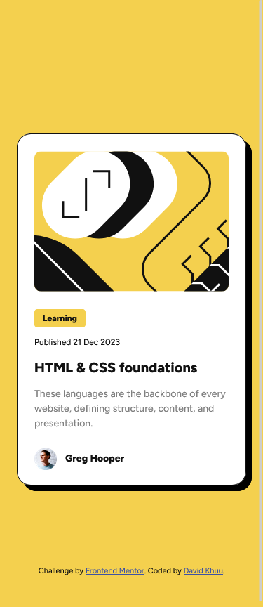

# Frontend Mentor - Blog preview card solution

This is a solution to the [Blog preview card challenge on Frontend Mentor](https://www.frontendmentor.io/challenges/blog-preview-card-ckPaj01IcS). Frontend Mentor challenges help you improve your coding skills by building realistic projects.

## Table of contents

- [Overview](#overview)
  - [The challenge](#the-challenge)
  - [Screenshot](#screenshot)
  - [Links](#links)
- [My process](#my-process)
  - [Built with](#built-with)
  - [What I learned](#what-i-learned)
  - [Continued development](#continued-development)
  - [Useful resources](#useful-resources)
- [Author](#author)

## Overview

### The challenge

Users should be able to:

- See hover and focus states for all interactive elements on the page

### Screenshot

### Links

- Solution URL: https://github.com/davidkhuu/frontend-mentor-blog-preview-card
- Live Site URL: https://davidkhuu.github.io/frontend-mentor-blog-preview-card

## My process

### Built with

- Semantic HTML5 markup
- CSS custom properties
- Flexbox
- [Sass](https://sass-lang.com/) - For styles

### What I learned

Adding some responsive styling in stylesheets.

### Continued development

I want to continue to learn responsive design and find more efficient ways to handle various screen sizes.

### Useful resources

- [Sass Docs](https://sass-lang.com/guide/)
- [W3 Schools](https://www.w3schools.com/)

## Author

- Website - [David Khuu](https://www.davidkhuu.com)
- Frontend Mentor - [@davidkhuu](https://www.frontendmentor.io/profile/davidkhuu)
- Twitter - [@davidkhuu](https://www.twitter.com/davidkhuu)